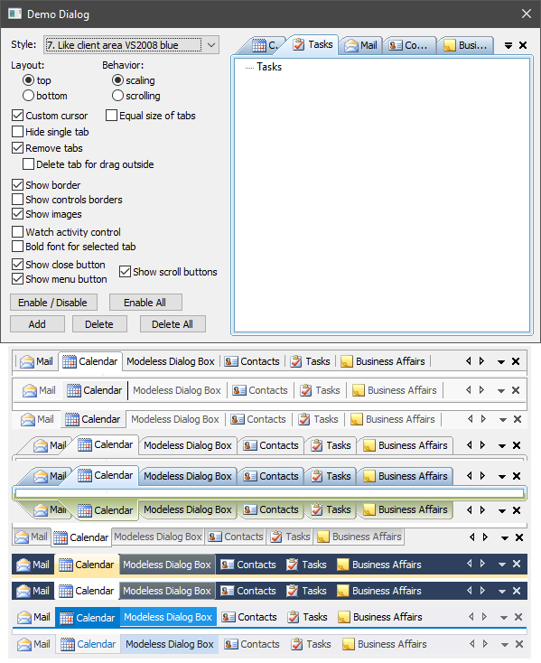
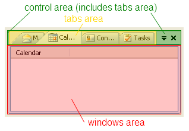

# TabCtrl



## Introduction

Tabs can be top or bottom of child windows. The user can drag tabs using the mouse. Control has a zoom (shrink of tabs) and scrolling tabs mode. Also, if there is one tab the area of tabs can be hidden.

Control has 28 built-in tab drawing styles, including tabs VS2003, VS2008, VS2010 and VS2019. Drawing for all styles is created programmatically and does not require resources. You can create your own style by editing an existing render class or creating a new one.

This control is based on `CWnd` class and can be placed as a child window anywhere, for example in the client area of the frame or dialog.

## Using the Code
Child windows are added using their `HWND` and they can be of any type, for example modeless dialogs. `TabCtrl` consists of three areas: control area, tabs area, windows area. This knowledge can be useful to you when creating a drawing class and working with `TabCtrl` functions.



To create the control and add elements to it, you can do the next steps:

```cpp
#include "TabCtrl.h"

TabCtrlEx<TabCtrlStyle_VS2019_client_light> m_TabCtrl;
CListCtrl m_List1, m_List2;

...

// Creation and initialization of TabCtrl.
if( !m_TabCtrl.Create(this,WS_CHILD | WS_VISIBLE,CRect(0,0,0,0),ID_TabCtrl) )
    return -1;    // error.

// Creation of ImageList with icons for buttons (close, menu, scroll) and for tabs.
if( !m_TabCtrl.CreateSystemImage(NULL,IDB_IMAGES_SYSTEM,true,14) ||
    !m_TabCtrl.CreateImage(NULL,IDB_IMAGES_TAB_NORMAL,IDB_IMAGES_TAB_DISABLE,true,16) )
    return -1;    // error.

// Creation of child windows.
if( !m_List1.Create(WS_CHILD | WS_CLIPCHILDREN | LVS_REPORT,CRect(0,0,0,0),&m_TabCtrl,ID_List1) ||
    !m_List2.Create(WS_CHILD | WS_CLIPCHILDREN | LVS_REPORT,CRect(0,0,0,0),&m_TabCtrl,ID_List2) )
    return -1;    // error.
m_List1.InsertColumn(0,"Mail",LVCFMT_LEFT,100);
m_List2.InsertColumn(0,"Calendar",LVCFMT_LEFT,100);

// Attaching of child windows to the TabCtrl.
if( !m_TabCtrl.Add(m_List1,"Mail",0) ||
    !m_TabCtrl.Add(m_List2,"Calendar",1) )
    return -1;    // error.

// Load state from registry and update.
m_TabCtrl.LoadState(AfxGetApp(),"TabCtrl","State");
m_TabCtrl.Update();
````
Class `TabCtrl` not perform any rendering. For its drawing, it calls the functions of `TabCtrl::Draw` interface. To draw `TabCtrl`, you need to create an object inherited from the `TabCtrl::Draw` class, implement its functions, and pass the `TabCtrl::Draw` pointer to `TabCtrl` using the `TabCtrl::SetDrawManager` function call.

Similarly, a `TabCtrl::IRecalc` interface is used to specify the size and spacing between `TabCtrl` areas. A `TabCtrl::IBehavior` interface will help you adjust the behavior of the `TabCtrl`, and a `TabCtrl::ToolTip` will help you create tooltips for tabs and buttons. There is also a `TabCtrl::Ability` class for setting the ability to click on buttons and a `TabCtrl::Notify` class for notifying about events in `TabCtrl`.

If you implement any of the above interfaces, then this implementation must exist for the entire time the control is running. If you are working with only one style, then use the template class TabCtrlEx. The name of the style class is specified as a template parameter, for example:

```cpp
TabCtrlEx<TabCtrlStyle_VS2003_client> m_TabCtrl;
````

Some styles have already been created. For example, styles similar to the docking/floating panels in Visual Studio 2003, 2008, 2010 and 2019. See the `TabCtrlComplex` class in the DemoDlg.h file for a list of all existing style classes.

Classes `ITabCtrlStyle::RecalcStub` and `ITabCtrlStyle::BehaviorStub` create a default implementation for the functions of `TabCtrl::IRecalc` and `TabCtrl::IBehavior` interfaces respectively. You can use them to create your own style classes.

The control requires a call of `Update()` after you add or delete tabs, as well as change its properties and state.

Good luck! :-)
